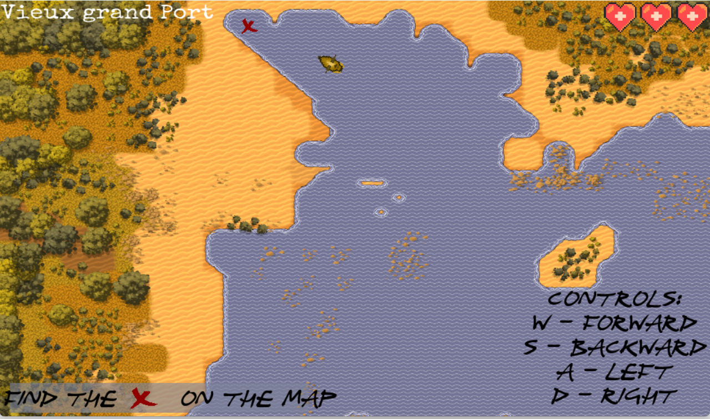
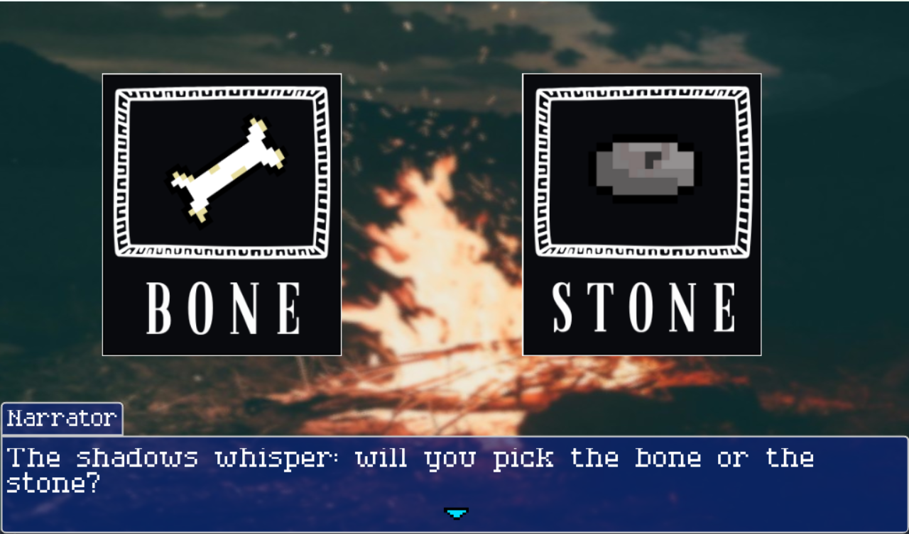
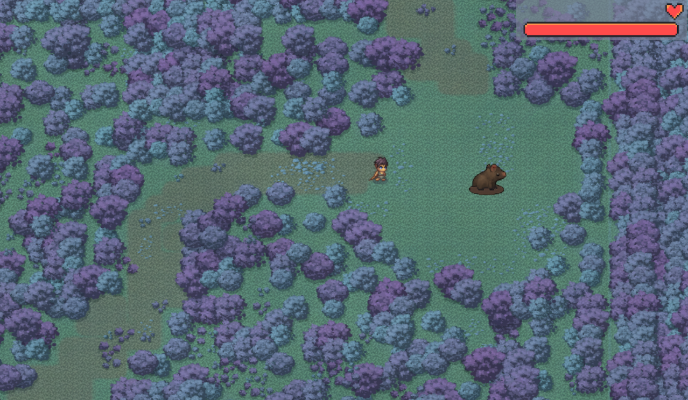
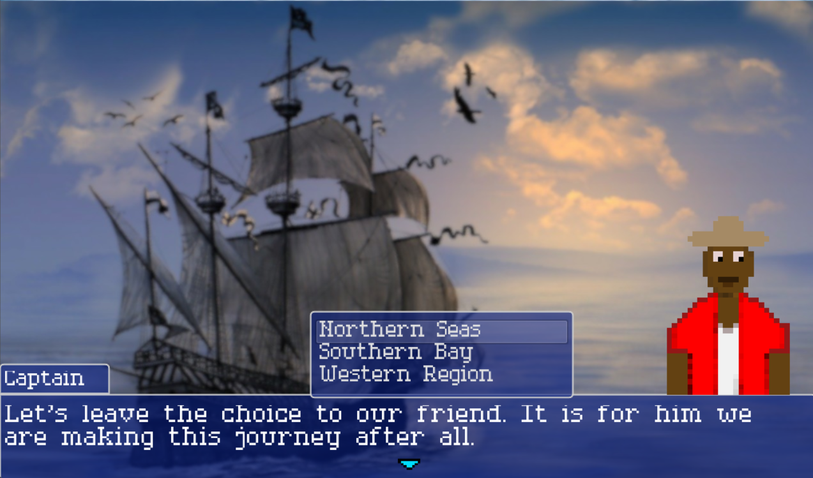
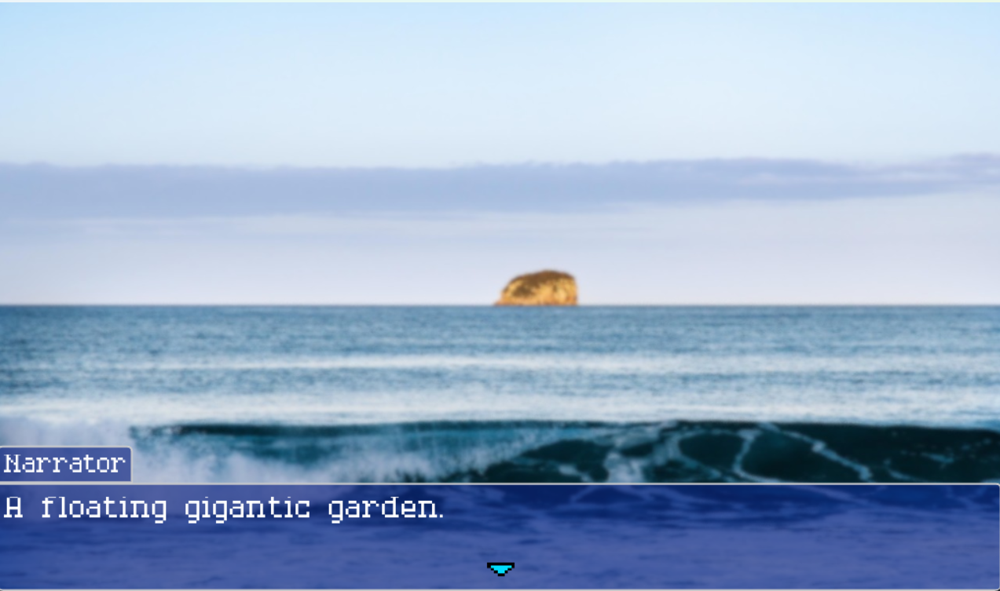

# **Forged Iron Paths**

## Summary

Step into the shoes of Mauritian maroons fighting for freedom. Explore forests, discover hidden grottoes, and make choices that shape the fate of a rebellion. Every decision counts… which path will you forge?

This **mini narrative, pixel-art, choice-based RPG game** was created for **The Geek’s Game Jam (2025)** in just **one week**, from **August 23, 2025, 5:30 PM to August 31, 2025, 11:59 PM**, as a collaboration between [devlizx](https://devlizx.itch.io/) and [Palyer1](https://itch.io/profile/palyer1).

---

## Tools & Tech

* **Game Engine:** Godot
* **Programming:** GDScript
* **Assets:** Mix of AI-generated assets and hand-drawn art by [Palyer1](https://itch.io/profile/palyer1)
* **Platform:** Itch.io

---

## Steps / Process

1. Interpreted the theme: *“Les Chapitres Inédits de l'île Maurice”*
2. Designed narrative and branching choices
3. Built pixel-art environments and characters
4. Programmed choice-based mechanics and outcomes
5. Tested, iterated, and polished within the one-week jam timeframe

---

## Screenshots

```





```

---

## Demo / Play

* [Play on Itch.io](https://devlizx.itch.io/forged-iron-paths)
* [Collaborator’s page](https://itch.io/profile/palyer1)

---

## Notes

* Completed under strict one-week time constraints
* Focused on creative interpretation of Mauritian folklore
* Demonstrates teamwork, rapid prototyping, and narrative design under pressure

---

If you want, I can also **draft the GitHub folder structure and push commands** for this game jam project so it’s ready to slot into your `questforcode` repo just like your RPA mini projects — organized, clean, and portfolio-ready.

Do you want me to do that next?
